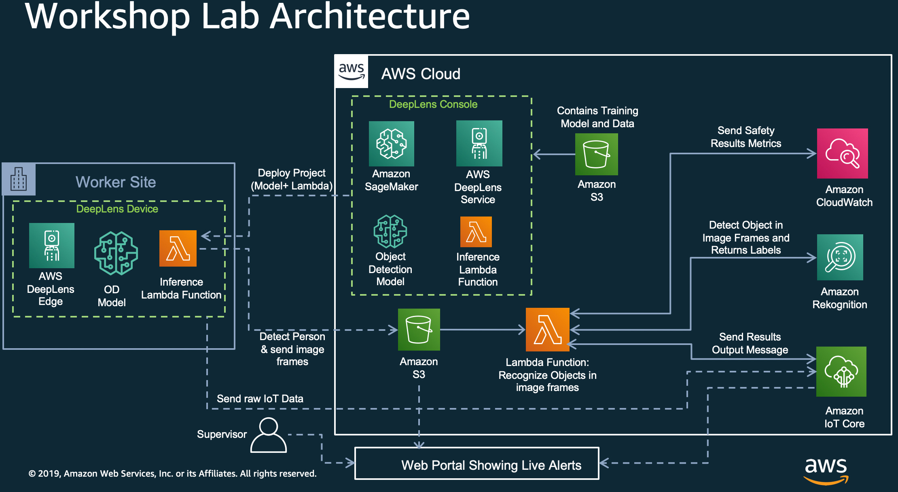

# Worker Safety with AWS DeepLens and Amazon Rekognition

## Learning Objectives of This lab
In this lab your will the following:
- Create and deploy object detection project to DeepLens.
- Modify the DeepLens object detection inference lambda function to detect persons and upload frame to S3.
- Create lambda function to identify persons who are not wearing safety hats.
- Analyze results using IoT and CloudWatch and Web Dashboard.

## Architecture

## Modules

### Register your DeepLens Device
If you recycle a device from another user, make sure that the previous user has deregistered the device before registering it again.

To configure your AWS account for AWS DeepLens

1. Sign in to the AWS Management Console for AWS DeepLens at https://console.aws.amazon.com/deeplens/home?region=us-east-1#firstrun.

2. Choose Register device. If you don't see a Register device button, choose Devices on the main navigation pane.

3. In the Name your device section on the Configure your AWS account page, type a name (e.g., lab1-deepLens) for your AWS DeepLens device in the Device name text field .
4. The device name can have up to 100 characters. Valid characters are a-z, A-Z, 0-9, and - (hyphen) only. 
5. In the Permissions section, choose Create roles for the AWS DeepLens console to create the required IAM roles with relevant permissions on your behalf.
- After the roles are successfully created, you'll be informed that you have the necessary permissions for setting the AWS DeepLens device. If the roles already exist in your account, the same message will be displayed.
6. In the Certificate section, choose Download certificate to save the device certificate.
7. The downloaded device certificate is a .zip file. Don’t unzip it.

**Important**

Certificates aren't reusable. You must generate a new certificate every time you register your device.

8. After the certificate is downloaded, choose Next to proceed to joining your computer to your device's (AMDC-NNNN) Wi-Fi network in order to start the device setup application hosted on the device. 
9. Plug in your AWS DeepLens device to an AC power outlet. Press the power button on the front of the device to turn the device on. 
10. Wait until the device has entered into setup mode when the Wi-Fi indicator (middle LED) on the front of the device starts to flash. 
    - *Note*: If Wi-Fi indicator (middle LED) does not flash, the device in no longer in the setup mode. To turn on the device's setup mode again, press CAREFULLY a paper clip into the reset pinhole on the back of the device. After you hear a click, wait about 20 seconds for the Wi-Fi indicator to blink. 
11. Open the network management tool on your computer. Choose your device's SSID from the list of available Wi-Fi networks and type the password for the device's network. The SSID and password are printed on the bottom of your device. The device's Wi-Fi network's SSID has the AMDC-NNNN format
12. After successfully connecting your computer to the device's Wi-Fi network, you're now ready to launch the device setup application to configure your device. 

### Create the *object-detection* model
1. Using your browser, open the AWS DeepLens console at https://console.aws.amazon.com/deeplens/.
2. Choose Projects, then choose Create new project.
3. On the Choose project type screen
  - Choose Use a project template, then choose Object detection.
  - Scroll to the bottom of the screen, then choose Next.
4. On the Specify project details screen
   - In the Project information section:
      - Project name: your-user-id-object-detection(example: lab1-object-detection)
      - Description: Detect objects.
  - Scroll to the bottom of the screen, then click Create.
5. Click on "*Models*" the left navigation of the console and make sure that a model called "*deeplens-object-detection*" is available.

**Important**: It's highly critical for the lab rest of the lab until this model is created.

### Setup IAM Role for Cloud Lambda

1. Go to IAM in AWS Console at https://console.aws.amazon.com/iam
2. Click on Roles
3. Click create role
4. Under AWS service, select Lambda and click Next: Permissions
5. Under Attach permission policies
    1. search S3 and select *AmazonS3FullAccess*
    2. search Rekognition and select checkbox next to *AmazonRekognitionReadOnlyAccess*
    3. search cloudwatch and select checkbox next to *CloudWatchLogsFullAccess* and *CloudWatchFullAccess*
    4. search iot and select *AWSIotDataAccess*
    5. search lambda and select checkbox next to *AWSLambdaFullAccess*
6. Click Next: Tags and Next: Review
7. Name the role “*RecognizeObjectLambdaRole*”
8. Click Create role

### Setup IAM Role for DeepLens Lambda

1. Click create role
2. Under AWS service, select Lambda and click Next: Permissions
3. Under Attach permission policies
    1. search S3 and select AmazonS3FullAccess
    2. search lambda and select checkbox next to AWSLambdaFullAccess
4. Click Next: Tags and Next: Review
5. Name is “DeepLensInferenceLambdaRole”
6. Click Create role

### Create S3 bucket

1. Go to Amazon S3 in AWS Console at https://s3.console.aws.amazon.com/s3/
2. Click on Create bucket.
3. Under Name and region:

* Bucket name: Enter a bucket name- your name-worker-safety (example: kashif-worker-safety)
* Choose US East (N. Virginia)
* Click Next

1. Leave default values for Configure Options screen and click Next
2.  Under Set permissions, uncheck all four checkboxes. NOTE: This step would allow us to make objects in your S3 bucket public. We are doing this to reduce few steps in the module, but you should not do that for production workloads. Instead it is recommended to use S3 Pre-Signed URLs to give time limited access to objects in S3.
3. Click Next, and click Create bucket.

### Create Cloud Lambda

1. Go to Lambda in AWS Console at https://console.aws.amazon.com/lambda/
2. Click on Create function.
3. Under Create function, Author from scratch should be selected as default.
4. Under Author from scratch:

* Name: worker-safety-cloud
* Runtime: Python 3.7
* Role: Choose and existing role
* Existing role: RecognizeObjectLambdaRole
* Click Create function

5. Under Environment variables, add a variable:

* Key: iot_topic
* Value: worker-safety-demo-cloud

6. Download [lambda.zip](./code/lambda.zip).
7. Under Function code:

* Code entry type: Upload a zip file
* Under Function package, click Upload and select the zip file you downloaded in earlier step.
* Click Save.

8. Under Add triggers, select S3.
9. Under Configure triggers:

* Bucket: Select the S3 bucket you just created in earlier step.
* Event type: Leave default Object Created (All)
* Leave defaults for Prefix and Suffix and make sure Enable trigger checkbox is checked.
* Click Add.
* Click Save on the top right to save changed to Lambda function.

### Create DeepLens Inference Lambda Function

1. Go to Lambda in AWS Console at https://console.aws.amazon.com/lambda/.
2. Click on Create function.
3. Under Create function, select Blueprints.
4. Under Blueprints, type greengrass and hit enter to filter blueprint templates.
5. Select greengrass-hello-world and click Configure.
6. Under Basic information:

* Name: name-worker-safety-deeplens (example: kashif-worker-safety-deeplens)
* Role: Choose and existing role
* Existing role: DeepLensInferenceLambdaRole
* Click Create function.

7. Copy the code from [deeplens-lambda.py](./code/deeplens-lambda.py) and paste under Function code for the lambda function. You can find the python file in your resources section.
8. Go to line 34 and modify line below with the name of your S3 bucket created in the earlier step.

* bucket_name = "REPLACE-WITH-NAME-OF-YOUR-S3-BUCKET"

9. Click Save.
10. Click on Actions, and then "Publish new version".
11. For Version description enter: Detect person and push frame to S3 bucket. and click Publish.

### Create DeepLens Project

1. Using your browser, open the AWS DeepLens console at https://console.aws.amazon.com/deeplens/.
2. Choose Projects, then choose Create new project.
3. On the Choose project type screen

* Choose Create a new blank project, and click Next.

4. On the Specify project details screen

    * Under Project information section:
        * Project name: your-user-name-worker-safety (example: kashif-worker-safety)
    * Under Project content:
        * Click on Add model, click on radio button for deeplens-object-detection and click Add model.
        * Click on Add function, click on radio button for your lambda function (example: kashif-worker-safety-deeplens) lambda function and click Add function.
* Click Create. This returns you to the Projects screen.

### Deploy DeepLens Project

1. From DeepLens console, On the Projects screen, choose the radio button to the left of your project name, then choose Deploy to device.
2. On the Target device screen, from the list of AWS DeepLens devices, choose the radio button to the left of the device where you want to deploy this project.
3. Choose Review. This will take you to the Review and deploy screen.
    If a project is already deployed to the device, you will see a warning message "There is an existing project on this device. Do you want to replace it? If you Deploy, AWS DeepLens will remove the current project before deploying the new project."
4. On the Review and deploy screen, review your project and click Deploy to deploy the project. This will take you to to device screen, which shows the progress of your project deployment.

### View Output in IoT

1. Go to IoT Console at https://console.aws.amazon.com/iot/home
2. Under Subscription topic enter topic name you entered as environment variable for Lambda in earlier step (example: worker-safety-demo-cloud) and click Subscribe to topic.
3. You should now see JSON message with a list of people detected and whether they are wearing safety hats or not.

### View Output in CloudWatch

1. Go to CloudWatch Console at https://console.aws.amazon.com/cloudwatch
2. Create a dashboard called “worker-safety-dashboard-your-name”
3. Choose Line in the widget
4. Under Custom Namespaces, select “string”, “Metrics with no dimensions”, and then select PersonsWithSafetyHat and PersonsWithoutSafetyHat.
5. Next, set “Auto-refresh” to the smallest interval possible (1h), and change the “Period” to whatever works best for you (1 second or 5 seconds)

### View Output in Web Dashboard

1. Go to AWS Cognito console at https://console.aws.amazon.com/cognito
2. Click on Manage Identity Pools
3. Click on Create New Identity Pool
4. Enter “awsworkersafety” for Identity pool name
5. Select Enable access to unauthenticated identities
6. We are using using Unauthenticated identity option to keep things simple in the demo. For real world application where you only want authorized users to access the app you should configure Authentication providers.
7. Click Create Pool
8. Expand View Details
9. Under: Your unauthenticated identities would like access to Cognito, expand View Policy Document and click Edit.
10. Click Ok for Edit Policy prompt.
11. Copy JSON from [cognitopolicy.json](./code/cognitopolicy.json) and paste in the text box.
12. Click Allow
13. Make note of the Identity Pool as you will need it in following steps.
14. Got to IoT in AWS Console at: https://console.aws.amazon.com/iot
15. Click on settings and make note of Endpoint, you will need this the following step.
16. Download [webdashboard.zip](./code/webdashboard.zip) and unzip on your local drive.
17. Edit aws-configuration.js and update poolId with Cognito Identity Pool Id and host with IoT EndPoint you got in earlier steps.
18. From terminal go to the root of the unzipped folder and run “npm install”
19. Next, run “./node_modules/.bin/webpack —config webpack.config.js”
20. This will create the build we can easily deploy.
21. Go to S3 bucket, and create a folder web
22. From web folder in S3 bucket click upload and select bundle.js, index.html and style.css.
23. From Set permission, Choose Grant public read access to the objects. and click Next
24. Leave default settings for following screens and click upload.
25. Click on index.html and click on the link to open the web page in browser.
26. In the address URL append ?iottopic=NAME-OF-YOUR-IOT-TOPIC. This is the same value you added to Lambda environment variable and hit Enter.
27. You should now see images coming from DeepLens with a green or red box around the person.

## Clean Up
Delete Lambda functions, S3 bucket and IAM roles.
